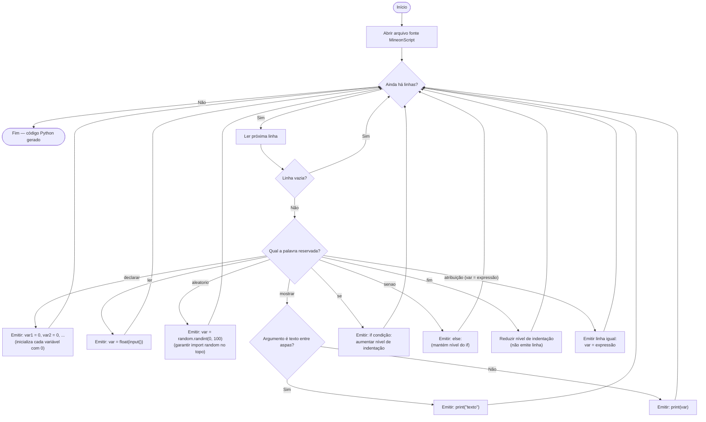

# Fluxograma — Tradutor MineonScript → Python

O tradutor lê o código-fonte MineonScript linha a linha, classifica cada comando pela palavra reservada inicial e emite a linha Python equivalente.

## Fluxograma



## Tabela de tradução

| MineonScript | Python |
|---|---|
| `declarar a, b, r` | `a = 0` `b = 0` `r = 0` |
| `a = 2 * b + 1` | `a = 2 * b + 1` (idêntico) |
| `mostrar "texto"` | `print("texto")` |
| `mostrar r` | `print(r)` |
| `ler x` | `x = float(input())` |
| `aleatorio n` | `n = random.randint(0, 100)` |
| `se x > 10 entao` | `if x > 10:` |
| `senao` | `else:` |
| `fim` | (fecha bloco — volta indentação) |

## Condicionalidade estrutural da linguagem

MineonScript delimita blocos por palavras reservadas; Python delimita por indentação. O tradutor precisa manter um **contador de nível de indentação**:

```
se <condição> entao      →  if <condição>:      (nível +1)
    <comandos>           →      <comandos>       (indentados)
senao                    →  else:                (mesmo nível do if)
    <comandos>           →      <comandos>
fim                      →  (nada — nível -1)
```

- `se ... entao` abre o bloco e incrementa o nível;
- `senao` é opcional, fica no mesmo nível do `se`;
- `fim` fecha o bloco e decrementa o nível — todo `se` exige um `fim` (blocos aninhados empilham níveis).

### Exemplo completo (Exercício C traduzido)

MineonScript:

```
declarar preco, valor, troco
preco = 4.50
ler valor
se valor > preco entao
    troco = valor - preco
    mostrar "Troco: R$ "
    mostrar troco
fim
```

Python gerado:

```python
preco = 0
valor = 0
troco = 0
preco = 4.50
valor = float(input())
if valor > preco:
    troco = valor - preco
    print("Troco: R$ ")
    print(troco)
```
